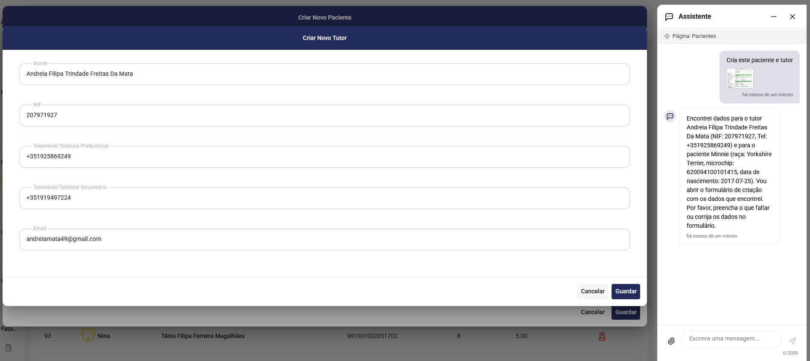
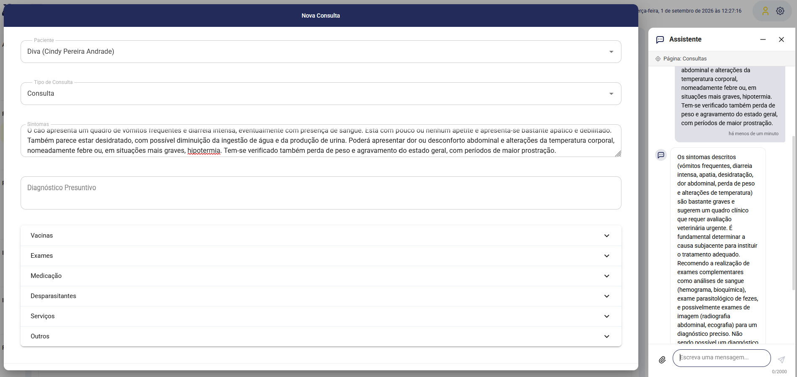

# Agentic Vet Assistant

**AI-powered assistant for veterinary clinics** — streamlines patient registration, clinical decision support, and data queries through natural language and image analysis.

> A veterinary professional types or uploads an image. The assistant understands the intent, extracts relevant data, and pre-fills the appropriate form — or answers clinical questions with context-aware recommendations.

---

## The Problem

Veterinary clinic management software is powerful but tedious. Registering a new patient means navigating menus, selecting the right form, typing each field manually. During a busy day with 20+ consultations, this friction adds up.

Clinical knowledge is another challenge — recalling dosages, differential diagnoses, or a patient's full history takes time away from the animal.

## The Solution

An AI layer that sits between the veterinarian and the existing management system:

- **Speak naturally** — "Register Rex, a Labrador, owner Maria Silva NIF 123456789"
- **Upload images** — a vaccination booklet photo gets parsed into structured data
- **Ask clinical questions** — "What's the recommended amoxicillin dose for a 25kg dog?"
- **Query patient data** — "Show me Rex's clinical history"

The assistant **never replaces the existing system** — it enhances it by understanding intent, extracting data, and routing the user to the right action with fields pre-filled.

---

## How It Works

```
┌─────────────────────────────────────────────────────────────┐
│                        Frontend                              │
│  Chat interface with image upload                           │
└──────────────────────────┬──────────────────────────────────┘
                           │ user message + images
                           ▼
┌─────────────────────────────────────────────────────────────┐
│                    PHP Backend (Laravel)                      │
│  Authentication, state management, conversation persistence  │
└──────────────────────────┬──────────────────────────────────┘
                           │ POST /chat (stateless)
                           ▼
┌─────────────────────────────────────────────────────────────┐
│                 AI Service (Python/FastAPI)                   │
│                                                              │
│  ┌──────────────┐  ┌──────────────┐  ┌──────────────────┐  │
│  │ Intent       │  │ Entity       │  │ Image            │  │
│  │ Classifier   │  │ Extractor    │  │ Processor        │  │
│  └──────┬───────┘  └──────┬───────┘  └────────┬─────────┘  │
│         │                  │                   │             │
│         ▼                  ▼                   ▼             │
│  ┌─────────────────────────────────────────────────────┐    │
│  │              LLM Provider (Gemini / OpenAI)          │    │
│  └─────────────────────────────────────────────────────┘    │
│                                                              │
│  ┌──────────────┐  ┌──────────────┐  ┌──────────────────┐  │
│  │ Breed/Species│  │ Clinical     │  │ PHP API          │  │
│  │ Normalizer   │  │ Advisor      │  │ Client           │  │
│  └──────────────┘  └──────────────┘  └──────────────────┘  │
└─────────────────────────────────────────────────────────────┘
```

---

## Features

### Intent Classification & Entity Extraction

The assistant classifies user messages into actionable intents and extracts structured entities ready to pre-fill forms.

**Supported intents:**

| Intent | Description | Frontend Action |
|--------|-------------|-----------------|
| `CREATE_OWNER_AND_PATIENT` | Register a new animal + owner | Opens creation form, pre-filled |
| `CREATE_OWNER` | Register a new owner | Opens owner form, pre-filled |
| `CREATE_PATIENT` | Register a new animal | Opens patient form, pre-filled |
| `ADD_VACCINES` | Record vaccinations | Opens vaccine form, pre-filled |
| `SEARCH_PATIENT` | Find an animal | Displays results |
| `SEARCH_OWNER` | Find an owner | Displays results |
| `GET_PATIENT_HISTORY` | View clinical history | Displays history |
| `GET_APPOINTMENTS` | View past appointments | Displays list |
| `CLINICAL_ADVICE` | Get diagnostic suggestions | Shows AI recommendations |
| `CHAT` | General conversation | Displays response |

**Example flow:**

```
User: "Adiciona o cão Rex, labrador, tutor Maria Silva NIF 123456789"

AI Response:
{
  "intent": "CREATE_OWNER_AND_PATIENT",
  "confidence": 0.95,
  "entities": {
    "owner": { "ownerName": "Maria Silva", "nif": "123456789" },
    "patient": { "patientName": "Rex", "species": "dog", "breed": "Labrador Retriever" }
  },
  "response": "Vou abrir o formulário com os dados do Rex e da tutora Maria Silva."
}

→ Frontend opens the creation form with all fields pre-filled
→ Vet reviews, corrects if needed, clicks "Create"
```

<!--  -->

---

### Image Analysis

Upload a photo of a vaccination booklet, clinical report, or patient record. The AI extracts structured data using multimodal analysis.

```
User uploads photo of vaccination booklet + "Adiciona a informação desta imagem"

AI extracts:
{
  "intent": "CREATE_OWNER_AND_PATIENT",
  "confidence": 0.91,
  "entities": {
    "owner": { "ownerName": "João Mendes", "nif": "987654321", "phoneNumber": "916543210" },
    "patient": { "patientName": "Mochi", "species": "dog", "breed": "Beagle", "microchip": "620098000654321" }
  }
}

→ Form opens with all extracted fields pre-filled from the image
```



---

### Clinical Decision Support

During an appointment, the vet can request AI-assisted clinical advice. The system fetches the patient's full history and generates contextual recommendations.

```
Vet clicks "AI Advice" button during appointment

Request: { patient_id: 12, symptoms: "Vomiting for 3 days, loss of appetite" }

Response:
## Differential Diagnoses
1. Acute gastritis (most likely given presentation)
2. GI foreign body (breed predisposition — Labrador)
3. Pancreatitis (rule out with bloodwork)

## Recommended Exams
- Complete blood count + serum biochemistry
- Abdominal X-ray (2 views)

⚠️ AI-generated suggestions. Final diagnosis is the veterinarian's responsibility.
```



The clinical advisor considers:
- Species, breed, age, weight
- Full clinical history (past appointments, surgeries, vaccinations)
- Current symptoms
- Known contraindications

---

### Smart Breed & Species Normalization

The AI extracts text freely ("labrador", "pastor alemão", "siamês") and a local fuzzy-matching engine normalizes to canonical values — zero extra API calls, zero tokens wasted.

```
Input: "labrador"     → Output: "Labrador Retriever"
Input: "pastor alemão" → Output: "Cão de Pastor Alemão"
Input: "Maine Cooon"   → Output: "Maine Coon" (typo corrected)
Input: "cão"          → Output: "dog" (DB-ready value)
```

<!--  -->

Supports 300+ dog breeds and 50+ cat breeds with alias mapping and fuzzy matching.

---

### Confidence-Based UX

The system returns a confidence score (0.0–1.0) with every classification. The frontend uses this to decide the interaction:

- **confidence >= 0.6** → Automatically open the relevant form/modal
- **confidence < 0.6** → Ask the user to confirm before redirecting

```
User: "talvez adicionar algo"

AI Response:
{
  "intent": "CREATE_PATIENT",
  "confidence": 0.42,
  ...
}

→ Frontend shows: "Parece que queres criar um paciente. É isso?"
→ Buttons: [Sim, abre o formulário] [Não]
```

<!--  -->

This prevents accidental navigation while maintaining a fast, fluid experience when the AI is confident.

---

### Contextual Awareness

The frontend sends page context with each message. If the vet is viewing a patient's file and asks "What was the last vaccine?", the AI knows which patient they're referring to — no need to specify.

```json
{
  "message": "Qual foi a última vacina?",
  "page_context": {
    "page": "patient_detail",
    "data": { "patient_id": 12, "name": "Rex", "species": "dog" }
  }
}

→ AI resolves "última vacina" = Rex's last vaccine
→ Returns the answer without asking "which patient?"
```

<!--  -->

---

### Entity Accumulation

Multi-turn conversations build up entity data progressively:

```
Turn 1: "Create a new patient called Rex"
        → entities: { patient: { patientName: "Rex" } }
        → Form opens with name filled

Turn 2: "He's a Labrador"
        → entities: { patient: { patientName: "Rex", breed: "Labrador Retriever" } }
        → Breed field updates in real-time

Turn 3: "Born March 2020"
        → entities: { patient: { patientName: "Rex", breed: "Labrador Retriever", birthDate: "2020-03" } }
        → Birth date field updates
```

<!--  -->

Each turn accumulates entities. The form updates in real-time as more data becomes available.

---

## Tech Stack

| Layer | Technology |
|-------|-----------|
| AI Service | Python, FastAPI, Pydantic |
| LLM Provider | Google Gemini 2.5 Flash / OpenAI GPT-4o (swappable) |
| Image Processing | Pillow (compression before LLM analysis) |
| Backend | PHP (Laravel) |
| Database | MySQL |
| Frontend | Vue.js |
| Communication | REST API, JWT auth, shared API key |

---

## Architecture Principles

- **AI service is stateless** — all conversation context is passed in each request by the PHP backend
- **No direct DB access** — the AI service communicates exclusively via the PHP API
- **No destructive operations** — the AI can read and suggest, but never delete data
- **Provider-agnostic** — swap between Gemini and OpenAI by changing one environment variable
- **Token-efficient** — images are compressed before LLM analysis; breed normalization is local (zero tokens)

---

## Security

- **API Key authentication** between services (shared secret)
- **Network isolation** — AI service binds to localhost only
- **CORS restriction** — configurable allowed origins
- **Input validation** — message length limits, image count limits
- **No secrets in responses** — errors are user-friendly, never expose internals

---

## Project Structure

```
agentic-vet-assistant/
├── ai_service/                    # AI microservice (Python/FastAPI)
│   ├── app/
│   │   ├── agents/               # Orchestrator (query routing)
│   │   ├── middleware/           # Auth, input validation
│   │   ├── providers/           # LLM adapters (Gemini, OpenAI)
│   │   ├── routers/            # HTTP endpoints (/chat, /clinical-advice)
│   │   ├── schemas/            # Pydantic models
│   │   ├── services/           # Intent classification, clinical advisor
│   │   └── utils/              # PHP API client, image processor, normalizer
│   ├── docs/                   # Integration documentation
│   ├── requirements.txt
│   └── .env.example
└── README.md
```

## Author

Built as a full-stack AI integration project demonstrating:
- Microservice architecture with AI orchestration
- Multi-modal LLM integration (text + image)
- Real-world domain knowledge (veterinary medicine)
- Production patterns (auth, error handling, token optimization)
- Clean separation of concerns between AI, backend, and frontend

---

## License

Private project — Clínica Veterinária Barcelinhos.
